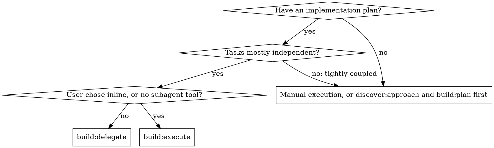
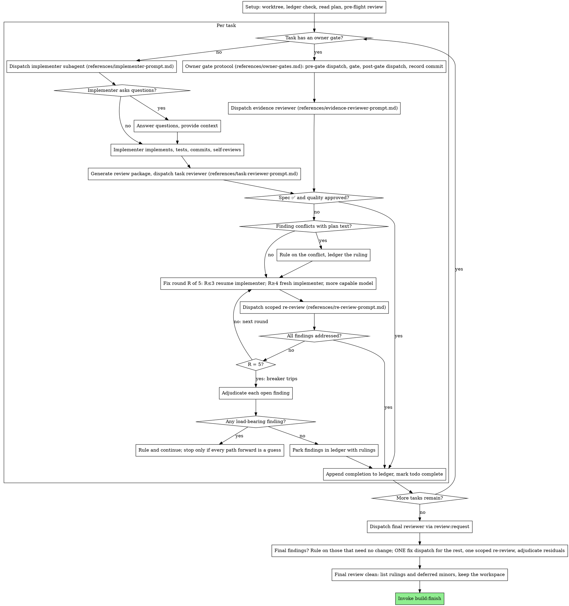

# Delegate

Execute the plan by dispatching a fresh implementer subagent per task, a task review (spec compliance plus code quality) after each, and a broad whole-branch review at the end.

**Why subagents.** You delegate tasks to specialized agents with isolated context.
By precisely crafting their instructions and context, you ensure they stay focused and succeed at their task.
They never inherit your session's context or history; you construct exactly what they need.
This also preserves your own context for coordination work.

**Core principle.** Fresh subagent per task, plus task review (spec and quality), plus a broad final review, equals high quality and fast iteration.

**Narration.** Between tool calls, narrate at most one short line; the ledger and the tool results carry the record.

**Continuous execution.** Do not pause to check in with the user between tasks.
They review planned work at two review gates: the plan before execution, and the pull request afterwards.
Between them they decide only at owner gates: the ones the plan declares, and the five stops below.
Execute all tasks from the plan without stopping anywhere else.
"Should I continue?" prompts and progress summaries waste their time; they asked you to execute the plan, so execute it.

**Rulings, not stalls.** A running plan does not wait on a human.
Conflicts, ambiguities, plan defects, a cap you would have asked to exceed: decide them.
The spec is the binding authority, the plan is its argument, and your judgment settles what neither answers.
Record every decision in the ledger as `Ruling: <what you decided>; <why>; <what it costs if wrong>`, and keep going.
A wrong ruling costs rework the user can see and undo; a session parked on a question costs their whole day and buys nothing.

**Five things stop you, besides the owner gates the plan declares:** an irreversible or destructive operation; a security-sensitive action; a side effect outside this worktree that norms say you ask about first (a merge, a push to the default branch, a force-push, closing a pull request, deleting a remote branch, a tag, a release, a publish; pushing the feature branch and opening its pull request are left to `build:finish`); a plan so broken that every path forward is a guess; and a check or hook that you could only get past by disabling, skipping or weakening it.
For those, stop and ask, through the protocol in [Owner gates](#owner-gates): the plan may have declared the stop as an owner gate, which the owner may have pre-approved by its ID, and a stop it did not declare is an unforeseen gate.
Never disable, skip or weaken a check or hook to make something pass, and never let an implementer do so.

## When to use



Compared with `build:execute` (inline):

- A fresh subagent per task (no context pollution) instead of one context doing every task.
- A review after each task (spec compliance plus code quality) instead of only at the end.
- Costs a fresh context per task and per review; inline costs one context plus one final reviewer.
- Both run in this session, share the same plan workspace and ledger, and never pause between tasks.

## The process



## Setup

### Isolated workspace

Ask the user once, at setup, whether to work in an isolated worktree, unless their instructions already say.
Prefer the harness's native worktree tool when one exists.
Otherwise fall back to git, with `.worktrees/` git-ignored:

```bash
git worktree add .worktrees/<branch> <branch>   # add -b <branch> when the branch does not exist yet
```

Never run a package install in the worktree: the environment is the repository's declared environment, and it follows the worktree.
Never start implementation on the main branch without the user's explicit consent.
`build:plan` committed the plan on the feature branch, so switch to that branch or create the worktree from it.
Every implementer works in this worktree; pass its path in the dispatch.

#### With devenv

Entering the worktree and running `devenv shell` gives the same environment as the main checkout; there is nothing to install.

### Workspace and ledger

Conversation memory does not survive compaction.
In real sessions, controllers that lost their place have re-dispatched entire completed task sequences, the single most expensive failure observed.
Track progress in a ledger file, not only in todos.

- Each plan owns a workspace: at skill start, run this skill's `scripts/workspace PLAN_FILE`.
  It prints the plan's git-ignored directory, `<repo-root>/tmp/build/<plan-slug>/`, home to every artifact for this plan: ledger, briefs, reports, review packages.
  Another plan's directory is never yours to read or write.
- Check for this plan's ledger at `<workspace>/progress.md`.
  If its first line names your plan file, tasks with a `<label>: complete` line are done: do not re-dispatch them; resume at the first task without one, as Resuming in [owner-gates.md](references/owner-gates.md) says when that task has a `<label> pre-gate:` line and so is at its gate.
  A task whose last line is a fix round is mid-loop: resume the loop at the next round.
  A ledger whose first line names a different plan file is another plan's progress: leave it in place and start your own, fresh.
- For a plan that declares owner gates or ends with an `## Execution status` section, read [owner-gates.md](references/owner-gates.md) and follow its Resuming, whether or not the run paused, and also on a fresh start with no ledger, because a lost workspace looks like one: its restore runs before you read the ledger, and its other steps once the ledger exists, so create the ledger with its identity line first when none exists and no Execution status will recreate it; it restores a paused run's ledger with `scripts/execution-status restore PLAN_FILE` and reconciles the ledger with `git log` from the merge base with the default branch, where a gated task that has acted shows as its record commit.
- Create the ledger with its identity as the first line: `# build ledger: plan <PLAN_FILE>`.
  `PLAN_FILE` is the plan's path relative to the repository root, in this line and in every script call, so a ledger restored in another checkout still names its plan.
- Name a task by its label wherever you write about it: the word `Task`, its number and, when the plan's heading for it has a slug, the slug, as in `Task 3 rate-limiter`.
  `scripts/task-brief PLAN_FILE N --label` prints it.
  In the ledger, in a shell argument, in a commit message and in a file name the slug is bare; in Markdown it is in backticks, as the heading has it.
  `<label>` stands for it in every ledger line format below and in the owner gate protocol, and a task's brief and report carry the slug in their file names.
  The number identifies the task, and the slug is there to catch a wrong number: when a ledger line's number and slug do not belong to one heading of the plan, do not read the line as progress until you have checked `git log` for the commits it names.
  When they are there, the task is done, and you ledger `State: "<the line>" is <label>`; when they are not, it is not done.
- The ledger is your recovery map: the commits it names exist in git even when your context no longer remembers creating them.
  After compaction, trust the ledger and `git log` over your own recollection.
- `git clean -fdx` will destroy the workspace (it is git-ignored scratch), and `tmp/` may be emptied at any time; if that happens, recover from the plan's Execution status when it has one, and from `git log` otherwise; for a plan with owner gates, Resuming in [owner-gates.md](references/owner-gates.md) says how.

### Read the plan

Read the plan once, note its context and Global Constraints, and create a todo per task.
Read the spec it names too: normally the `## Design` section of the same file, otherwise the external spec the plan header points at.
The spec is the authority the plan argues from, and conflicts inside the plan resolve against it.
A plan with no reachable spec gets a ledger note saying so; rulings made without one are provisional.

Before dispatching Task 1, scan the plan once for conflicts, writing down what you checked as you check it:

- tasks that contradict each other or the plan's Global Constraints
- anything the plan explicitly mandates that the review rubric treats as a defect (a test that asserts nothing, verbatim duplication of a logic block)

The scan's output is a table, not a verdict.
One row for every pair of tasks that share a file or an interface: the two tasks, what one produces against what the other consumes, and what you found.
One row for every task: whether its own text agrees with itself, its acceptance lines against its Interfaces block, its dictated text against its States, the files it creates against the files it later touches.
"The scan is clean" without those rows is not a scan you ran.

Write the table to the ledger.
Rule on everything you find before execution begins, each finding against the plan text that mandates it, with the spec as the binding authority and the plan as its argument, and record each ruling beside its row.
If the scan is clean, proceed without comment and dispatch Task 1.
The review loop remains the net for conflicts that only emerge from implementation.

## Model selection

Use the least powerful model that can handle each role, to conserve cost and increase speed.

**Plan tasks:** use a mid-tier model for the implementer of every plan task.
The plan is written for a skilled developer: it gives the interfaces, the acceptance lines and the facts of the repository, and the implementer writes the tests and the code, which the cheapest tier does poorly from prose.

**Tasks that need broad judgment** (the task judges other work, or its Intent says it needs an understanding of the whole codebase): use the most capable available model.
The final whole-branch review is one of these; dispatch it on the most capable available model, not the session default.

**Mechanical work:** the cheapest tier keeps the batch of small same-shape edits and the single-file mechanical fix, where the dispatch lists every file with its change.

**Review tasks:** choose the model with the same judgment, scaled to the diff's size, complexity and risk.
A small mechanical diff does not need the most capable model; a subtle concurrency change does.
Scoped re-reviews of small fix diffs take a cheap-to-mid tier; one that carries a walk list takes at least a mid-tier model, because it reasons about states the diff does not show.

**Evidence reviews** of tasks with an owner gate: at least a mid-tier model, and the most capable one when the action was destructive; a wrong verdict leaves an unverified change on a live system.

**Fix-loop escalation (rounds 4 and 5):** use a model at least one tier above the implementer that got stuck.

**Always specify the model explicitly when dispatching a subagent.**
An omitted model inherits your session's model, often the most capable and most expensive, which silently defeats this section.

**Turn count beats token price.**
Wall-clock and context cost scale with how many turns a subagent takes, and the cheapest models routinely take two to three times the turns on multi-step work, costing more overall.
Use a mid-tier model as the floor for task reviewers and for the implementers of plan tasks.
The reviewer of a task with a States block reasons about states the diff does not show, as a re-review with a walk list does.

Signals for an implementation dispatch:

- A plan task: mid-tier model.
- A batch of same-shape edits, or a single-file mechanical fix: cheap model.
- A task that judges other work or needs broad codebase understanding: most capable model.

## The task loop

**Batch small same-shape work.**
When the plan lists several tasks that are each a small, independent edit of the same kind (the same one-line fix, constant change, or field addition repeated across files), do not dispatch one subagent per task.
Compose ONE dispatch brief listing every file and its change, send the whole batch to a single subagent, and review its diff as one unit.
Reserve one dispatch per task for work that needs its own judgment, its own tests, or its own review surface.

Everything you paste into a dispatch prompt, and everything a subagent prints back, stays resident in your context for the rest of the session and is re-read on every later turn.
Hand artifacts over as files.

**Waiting on dispatched subagents.**
Never poll a wait interface with short timeouts, and never sit in one silent, open-ended wait either.
While you have local work (ledger updates, packaging the next review, reading reports), keep working; child results arrive on their own.
When you are genuinely idle, wait in bounded stretches (five to ten minutes, where your platform allows), and between stretches post one line of status and reconcile your live children: list them, and chase any that finished without reporting.
A bounded stretch keeps nearly all of a long wait's efficiency while guaranteeing a stuck or lost child is noticed within minutes, not at the end of the session.

### 1. Dispatch the implementer

Record BASE (`git rev-parse HEAD`) before dispatching; the review package and fix-round diffs need it.

- **Task brief.** Before dispatching an implementer, run this skill's `scripts/task-brief PLAN_FILE N`; it extracts the task's full text, followed by the plan's Global Constraints section, to a brief in the workspace named after the task's number and slug (`task-3-rate-limiter-brief.md`) and prints the path.
  There is one brief per task, and every call writes the same plan text, so regenerating it after compaction or in a new session is harmless.
  Compose the dispatch so the brief stays the single source of requirements.
  Your dispatch contains: (1) one line on where this task fits in the project; (2) the brief path, introduced as "read this first; it is your requirements, with the exact values to use verbatim"; (3) interfaces and decisions from earlier tasks that the brief cannot know; (4) your resolution of any ambiguity you noticed in the brief; (5) the report-file path and report contract.
  Exact values (numbers, magic strings, signatures, acceptance lines, dictated text) appear only in the brief.
  Never make a subagent read the whole plan file.
  A task with an owner gate gets two briefs, one per part, as [Owner gates](#owner-gates) says.
- **Report file.** Name the implementer's report file after the brief, with `-report.md` in place of `-brief.md` (brief `task-3-rate-limiter-brief.md`, report `task-3-rate-limiter-report.md`, same workspace), and put it in the dispatch prompt.
  The implementer writes the full report there and returns only status, commits, a one-line test summary, and concerns.
  There is one report per task, and two for a task with an owner gate, one per part, as with its briefs.
  A report file that already exists is a prior attempt's memory (a dispatch before compaction, or an earlier session): never delete or rename it.
  Hand its path to the new implementer with the framing fix rounds 4 and 5 use: "A prior implementer attempted this task; you own it now. Read the report file for what was tried."
  The implementer appends its own report under a dated heading.
- A dispatch prompt describes one task, not the session's history.
  Do not paste accumulated prior-task summaries ("state after Tasks 1 to 3") into later dispatches; a real session's dispatch hit 42k characters of which 99% was pasted history.
  A fresh subagent needs its task, the interfaces it touches, and the global constraints, which the brief carries.
  Nothing else.
- The dispatch carries the no-subagents contract (it is in the implementer template): the implementer never dispatches subagents, not helpers, and never a reviewer.
  Review arrives from you, after the report.
  In real sessions, every reviewer a worker spawned duplicated the task review the controller dispatched anyway: a full extra review seat per task.
- If an earlier task parked a finding in the area this task touches, carry a pointer to that ledger entry in the dispatch.
- Record the implementer's agent identity from the dispatch result; fix-loop rounds 1 to 3 resume this agent.
- Never dispatch multiple implementation subagents in parallel (conflicts).

Template: [implementer-prompt.md](references/implementer-prompt.md)

### 2. Handle the report

Implementer subagents report one of four statuses.
Handle each appropriately.

**DONE:** generate the review package (this skill's `scripts/review-package PLAN_FILE BASE HEAD`, run from the repository root; it prints the path of the file it wrote, one per range; BASE is the commit you recorded before dispatching the implementer, never `HEAD~1`, which silently drops all but the last commit of a multi-commit task), then dispatch the task reviewer with the printed path.

A report without its Acceptance item, or without the task test command when the task has tests, for a brief that has acceptance lines, is incomplete: resume the implementer for the missing part before you dispatch the review.

**DONE_WITH_CONCERNS:** the implementer completed the work but flagged doubts.
Read the concerns before proceeding.
If the concerns are about correctness or scope, address them before review.
If they are observations ("this file is getting large"), note them and proceed to review.

**NEEDS_CONTEXT:** the implementer needs information that was not provided.
Provide the missing context and re-dispatch.

**BLOCKED:** the implementer cannot complete the task.
Assess the blocker:

1. If it is a context problem, provide more context and re-dispatch with the same model.
2. If the task requires more reasoning, re-dispatch with a more capable model.
3. If the task is too large, break it into smaller pieces.
4. If the plan itself is wrong, rule on the correction, ledger it, and re-dispatch with the ruling carried in the dispatch.

A BLOCKED report that names a state and a sentence of dictated text is the fourth case, and the state wins.
Rule on the smallest rewording that gives the state its outcome, ledger the ruling, and ledger the new wording as a `State:` line too, because it supersedes the plan's text for every reviewer from then on.
Re-dispatch with the reworded sentence carried in the dispatch.

Never ignore an escalation or force the same model to retry without changes.
If the implementer said it is stuck, something needs to change.

If the implementer asks questions, before starting or mid-task, answer clearly and completely, provide additional context if needed, and do not rush it into implementation.

### 3. Review the task

Per-task reviews are task-scoped gates.
The broad review happens once, at the final whole-branch review.
Never skip the task review, and never accept a report missing either verdict: spec compliance AND task quality are both required.
Implementer self-review never replaces the task review; both are needed.

- Hand the reviewer its diff as a file: run this skill's `scripts/review-package PLAN_FILE BASE HEAD` and pass the reviewer the file path it prints (or, without bash: `git log`, `git diff --stat` and `git diff -U10` for the range, redirected to one uniquely named file).
  The output never enters your own context, and the reviewer sees every commit with its full message, the stat summary and the full diff with context in one read.
  Use the BASE you recorded before dispatching the implementer, never `HEAD~1`, which silently truncates multi-commit tasks.
  Never dispatch a task reviewer without a diff file.
- **Reviewer inputs:** the task reviewer gets three paths (the same brief file, the report file, and the review package), at most one sentence of emphasis, and the state changes since the inputs were written, when there are any.
- The brief carries the plan's Global Constraints section, so the reviewer reads the binding requirements where the implementer read them; never paste them into the dispatch.
  Your one sentence of emphasis is the attention lens: the constraint, or the relationship the spec states between components ("same layout as X", "matches Y"), that this task is most likely to break.
  The reviewer's template already carries the process rules (YAGNI, test hygiene, review method); the emphasis is for what THIS project's spec demands.
- State changes are the facts that superseded the plan, the spec or an inventory after they were written: manual actions, resources removed, decisions the user took in chat.
  Ledger each one as `State: <fact>` when you learn it, and hand the ledger's `State:` lines to every reviewer from then on, task, re-review and final alike.
  A reviewer that sees only the plan reports findings against a world that no longer exists.
- Do not add open-ended directives like "check all uses" or "run race tests if useful" without a concrete, task-specific reason.
- The task reviewer runs the task's own test files once, with the command the report names; its template says so.
  Do not ask any reviewer for more (the whole suite, a race run, a repeat); a re-reviewer follows its own template, and the fix report carries its test evidence.
- Do not pre-judge findings for the reviewer: never instruct a reviewer to ignore or not flag a specific issue.
  If you believe a finding would be a false positive, let the reviewer raise it and adjudicate it in the review loop.
  If the prompt you are writing contains "do not flag", "don't treat X as a defect", "at most Minor" or "the plan chose", stop: you are pre-judging, usually to spare yourself a review loop.

The task reviewer may report "⚠️ Cannot verify from diff" items: requirements that live in unchanged code or span tasks.
These do not block the rest of the review, but you must resolve each one yourself before marking the task complete: you hold the plan and cross-task context the reviewer lacks.
If you confirm an item is a real gap, treat it as a failed spec review; it enters the fix loop with the other findings.

Template: [task-reviewer-prompt.md](references/task-reviewer-prompt.md)

### 4. The fix loop

The loop triggers when the review reports spec ❌, any Critical or Important finding, or a ⚠️ item you confirmed as a real gap.

Before the loop starts, two routes leave it immediately:

- Record Minor findings in the progress ledger as you go (`<label>: minor (deferred): <one-liner>`), and point the final whole-branch review at that list so it can triage which must be fixed before the pull request.
  A roll-up nobody reads is a silent discard.
  Minor findings never enter the loop.
- A finding labeled plan-mandated, or any finding that conflicts with what the plan's text requires, is yours to rule on: weigh the finding against the plan text, decide with the spec as the binding authority, and ledger the ruling before you act on it.
  Do not dismiss the finding because the plan mandates it, and do not dispatch a fix that contradicts the plan without a recorded ruling.

Everything else enters the loop.
A fix round is one fix dispatch plus one scoped re-review.
Five rounds maximum per task.

**A fix to protocol text gets a state walk first.**
Protocol text names states and the events that move between them, or states a rule that holds across steps: a procedure with gates, pauses and resumes, a ledger's line formats and what reads them, a prompt template with a variant per case.
The test is whether the sentence a finding wants changed is read on more than one path (a fresh and a resumed run, a first attempt and a retry, an action the agent or the owner performs); a value, a command or a step's wording that is read on one path gets no walk.
Before the fix dispatch, write the walk list, every state and path that reads the sentence with the outcome it must give there, and check any wording you dictate against each entry and against the sentences it could contradict.
Send the walk list with the findings, so the implementer checks its fix against the same states, and hand it to the re-review.
No test runs such text.
In a real session, three dictated fixes to one protocol each introduced a new Important finding that only the next review cycle found.

**Rounds 1 to 3: resume the original implementer.**
Send it the open findings verbatim.
Its context is intact: it knows the task, the code, and its own choices.
If your harness cannot send another message to a live subagent, dispatch a fresh implementer carrying the brief path, the report-file path, and the findings; the report file is the persistent memory either way.

**Rounds 4 and 5: dispatch a fresh implementer on a more capable model** (per Model selection), with the brief path, the report-file path, the open findings, and this framing: "A prior implementer attempted this task [N] times; you own it now. Read the report file for what was tried."
A loop that survives three resumes usually means the implementer cannot see its own problem; fresh eyes and a capability bump in one move.

**Every round, either way:** the implementer fixes, re-runs the tests covering the amended code, appends its fix report to the same report file, and returns the short contract.
Before re-dispatching the reviewer, confirm the fix report contains the covering tests, the command run, and the output; dispatch the re-review once all three are present.
Name the covering test files in the fix message; a one-line fix does not need the whole suite.

**The re-review is scoped.**
Run `scripts/review-package PLAN_FILE FIX_BASE HEAD`, where FIX_BASE is the head the previous review saw, and dispatch [re-review-prompt.md](references/re-review-prompt.md) with the findings list, the walk list when the round had one, the brief, the report file, the printed diff path, and the ledger's `State:` lines, if any.
The re-reviewer verdicts each finding ADDRESSED or NOT ADDRESSED and each entry of a walk list HOLDS or BROKEN, and flags new breakage in the fix diff only.
The walk is the one check that reads beyond the fix diff, and a BROKEN state is a defect of the fix wherever the sentence it contradicts sits.
A BROKEN state and new Critical or Important breakage in the fix diff join the open findings list.
Out-of-scope observations go to the ledger as deferred minors; they never extend the loop.

**After each round,** append to the ledger:
`<label>: fix round <R>/5 (<X> addressed, <Y> open; <finding one-liners>; commits <a7>..<b7>)`

Never fix findings yourself in the controller session: your context stays clean for coordination, and controller fixes skip review.

**The breaker.**
When round 5's re-review still leaves findings open, stop dispatching.
Adjudicate each open finding yourself; you hold the plan and the cross-task context the reviewer lacks:

- **The reviewer is wrong, or the point is contestable:** park it as `<label>: parked; <finding>; Ruling: <why the code stands>`.
  The final review sees both sides.
- **Real, but nothing downstream builds on it:** park it the same way, with a ruling that says it is real and deferred.
- **Real and load-bearing** (a later task builds on it, or it reveals a plan defect): rule on the smallest change that unblocks the dependent work, ledger it as `<label>: Ruling: <finding>; <what you decided and why>`, and carry it into the next task's dispatch.
  Parking a structural failure silently lets every dependent task build on it.
  Stop only when the defect leaves every path forward a guess.

Adjudicate only at the cap.
Adjudicating earlier to end a loop is pre-judging with a different name.
Every adjudication is a ledger entry; a silent discard is forbidden.

### 5. Complete the task

When the review comes back clean, or every open finding is parked with a ruling at the cap, append the completion line to the ledger in the same message as your other bookkeeping:

- `<label>: complete (commits <base7>..<head7>, review clean)`
- `<label>: complete (commits <base7>..<head7>, <K> parked)` after a tripped breaker

Then mark the todo complete and move on.
A task with an owner gate completes as step 8 of [owner-gates.md](references/owner-gates.md) says: its line reads `evidence review clean`, or `<K> parked` after a tripped breaker, and then you remove its temporary files, the `Temporary:` entries of its Files block.
Never move to the next task while the review has open Critical or Important issues that are neither fixed nor parked with a ruling at the cap.

## Owner gates

A task with an owner gate (a step `` - [ ] **Step N: Owner gate `<id>`** ``) runs in two dispatches around the gate, and you take the gate itself: an implementer cannot ask the owner anything.
Read [owner-gates.md](references/owner-gates.md) at setup, where its Resuming runs, and follow it step by step: the pre-gate dispatch with the implementer template's pre-gate `[OWNER_GATE]` text, pinning, the pre-approval check, the gate message, the fresh post-gate dispatch that carries the approval in the implementer template's `[OWNER_GATE]` block, the record commit, the evidence review with [evidence-reviewer-prompt.md](references/evidence-reviewer-prompt.md), pausing and resuming.
Each of the five stops above that the plan did not declare runs the same protocol as an unforeseen gate.
The evidence review takes the place of the task review for a gated task.
Screen its findings before any fix round: one whose fix needs another live action becomes an unforeseen gate, never a fix round; the rest go through the fix loop like any other.
Fix rounds 1 to 3 resume the post-gate implementer.
Every fix dispatch for a gated task after its post-gate part has acted, resumed or fresh (rounds 4 and 5, the fallback when the harness cannot resume, and the final review's fix wave whenever it touches a gated task), carries the implementer template's fix-round `[OWNER_GATE]` text, whether the agent or the owner performed the action, not the post-gate block, whose checks fail by construction once the action has run.
A resumed implementer gets the fix-round text with the findings, since its context still holds the post-gate block.
The scoped re-review after an evidence-review fix gets the evidence reviewer's read-only access to the live system in the re-review template's `[LIVE_ACCESS]` section, whatever the findings are about, so it can verify a finding about live state and confirm that the fix round took no effect there.

## Final review

The final whole-branch review gets a package too: run `scripts/review-package PLAN_FILE MERGE_BASE HEAD` (MERGE_BASE is the commit the branch started from, for example `git merge-base main HEAD`), so the final reviewer reads one file instead of re-deriving the branch diff with git commands.
The final review stays after the last task, gated or not; the record commits of the gated tasks are in its package.
A finding whose fix needs a live change gets an unforeseen owner gate in the fix wave.

Call the Skill tool for `review:request`; it carries the reviewer template.
Dispatch on the most capable available model (see Model selection) and hand it: the review package path; the plan and its Design section (or the external spec); the plan's Review Focus section verbatim, if it has one (the input classes and failure modes the plan's tests do not exercise, which the reviewer checks deliberately); the ledger's deferred-minor, parked and `Ruling:` lines, so it can triage which must be fixed before the pull request and weigh the calls you made; and the ledger's `State:` lines, so it judges the branch against the world as it is now, not as the plan found it.

If the final whole-branch review returns findings, dispatch ONE fix subagent with the complete findings list, not one fixer per finding.
A final finding that conflicts with the plan or the owner gate protocol, or that needs no change to the branch, is yours to rule on and ledger, as in the task loop; the fix dispatch takes the findings that remain after your rulings.
A finding whose fix changes protocol text gets the fix loop's state walk before that dispatch, and its walk list goes into the dispatch and into the re-review.
Per-finding fixers each rebuild context and re-run suites; a real session's final-review fix wave cost more than all its tasks combined.
Then run exactly one scoped re-review of the fix wave (`scripts/review-package PLAN_FILE FIX_BASE HEAD` over the fix range, with [re-review-prompt.md](references/re-review-prompt.md)).
Adjudicate any residual findings as in the task loop's breaker: park with rulings, or rule on the load-bearing ones and ledger what you decided.
Only owner gates, the five stops above among them, stop you here.
There is no second fix wave; residual load-bearing findings reach the user in the rulings list, in the pull request description that `build:finish` writes.

## Finish

Collect every ledger line containing `Ruling:` (pre-flight rulings, parked findings, breaker adjudications, all of them) into your final message under "Rulings I made", in the order you made them, each with what it costs if wrong, every `minor (deferred)` line under "Deferred minors", and, under "Owner gates", one entry per gate from its `Gate` lines: its ID, the owner's answer or the pre-approval, and the record commit of its task.
All three lists are exhaustive: if the ledger holds a ruling, the list holds it.
Your final message is where the decisions you took on the user's behalf, and the findings nobody acted on, reach them: `build:finish` puts these three lists in the pull request description, and the user reads the pull request starting from them and asks for changes where you got it wrong.
A ruling that dies with the workspace was a decision made in secret.

When the final whole-branch review is clean and its fixes are committed, leave this plan's workspace in place and hand it to `build:finish`.
It reads the ledger's deferred minors and parked findings, and the owner gates from their record commits, before it removes the plan, so the user can keep the findings worth doing, and it removes the workspace once the work lands.
Sibling directories belong to other plans; leave them alone.

Call the Skill tool for `build:finish`.

## Common rationalizations

| Excuse | Reality |
| --- | --- |
| "Close enough on spec compliance" | Reviewer found spec gaps = not done. Fix or hit the cap and adjudicate; those are the only exits. |
| "The report shows RED and GREEN, the reviewer need not run anything" | The report is a claim. One run of the task's own test files is the check, and a line without a test that would fail is Missing. |
| "I'll fix it myself, dispatching is overhead" | Controller fixes pollute your context and skip review. Resume the implementer. |
| "One more round will converge" | Past the cap, rounds don't converge; the failure is structural. Adjudicate and route. |
| "The reviewer will just find something new anyway" | Scoped re-reviews verify fixes; they cannot wander. New findings on untouched code go to the ledger, not the loop. |
| "This finding is obviously wrong, I'll drop it" | You adjudicate only at the cap, and every ruling is a ledger entry. Silent discards are forbidden. |
| "The fix was small, skip the re-review" | Unreviewed fixes are how regressions land. Every round ends with a scoped re-review. |
| "It is one sentence of the protocol, no walk needed" | That sentence is read in every state that reaches it. The fixes that broke a state nobody listed were that small. |
| "Reviews slow the loop down" | The loop without reviews is just unverified churn. Reviews are the loop's brakes and steering. |
| "Ledger bookkeeping is overhead" | The ledger is what survives compaction. Controllers without one have re-dispatched entire completed task sequences. |
| "The implementer spawned its own reviewer, free extra assurance" | It's a duplicate seat reviewing the same diff; the task review is the gate. A worker-spawned reviewer is a defect to flag, not rigor. |
| "The hook fails on something unrelated, tell the implementer to skip it" | A check you would have to skip is a stop condition, not an obstacle. Stop and ask. |
| "Let me check in before the next task" | The user reviews the plan and the pull request and answers owner gates, nothing else in between. Only owner gates, the five stops among them, stop you. |
| "The review is clean, delete the workspace now" | `build:finish` reads the ledger's deferred minors and parked findings before the plan goes, and removes the workspace when the work lands. Deleted first, they survive only as chat. |
| "The owner will obviously say yes, I'll run the apply now" | Only an explicit yes passes a gate, or a pre-approval the plan's index records by the gate's ID. |
| "The artifact is identical to the one approved before the pause" | A run-time approval lapses when the session that received it ends before the post-gate part starts. Re-run the pre-gate part and ask again; an unforeseen gate is the exception, which Resuming in the protocol describes. |
| "The task changed nothing in the repository, so there is nothing to commit" | A gated task ends with its record commit, empty if need be; the evidence lives in its message. |
| "Resume the pre-gate implementer for the post-gate part" | The post-gate part is a fresh dispatch that carries the approval; the gate may have spanned sessions. |

## Example workflow

The test output below is an example; the repository's own test command decides.

```text
[Setup: worktree confirmed with the user; on branch feature/recovery]
[Read plan file once: docs/plans/2026-09-23-recovery.md; Design section read]
[Resolve workspace: scripts/workspace docs/plans/2026-09-23-recovery.md; no ledger inside]
[Task 3 apply-saved-plan has an owner gate, so follow Resuming: no Execution status, so create the ledger with its identity line; git log from the merge base shows only the plan commit; fresh start]
[Ledger: Reconcile 2026-09-23T13:10:05+0800: 9f8e7d6..HEAD; nothing to recover]
[Create todos for all tasks]

Task 1 `hook-install`: Hook installation script

[Run task-brief for Task 1 hook-install; dispatch implementer with brief + report paths + context]

Implementer: "Before I begin: should the hook be installed at user or system level?"

You: "User level, under the user's configuration directory; the path is in the brief's Global Constraints."

Implementer: [Later]
  - Implemented install-hook command
  - Added tests, 5/5 passing; Acceptance: one covering test per line
  - Task test command: node --test test/install-hook.test.js
  - Self-review: found I missed the --force flag, added it
  - Committed

[Run review-package PLAN_FILE BASE HEAD; dispatch task reviewer with the printed path]
Task reviewer: Spec ✅, all requirements met, nothing extra.
  Acceptance: line 1 COVERED by test/install-hook.test.js "installs at user level";
  line 2 COVERED by "--force overwrites an existing hook".
  Tests run: node --test test/install-hook.test.js, 5/5 passing, as reported.
  Strengths: good test coverage, clean. Issues: none. Task quality: Approved.

[Ledger: Task 1 hook-install: complete (commits a1b2c3d..d4e5f6a, review clean)]

Task 2 `recovery-modes`: Recovery modes

[Run task-brief for Task 2 recovery-modes; dispatch implementer with brief + report paths + context]

Implementer: [No questions]
  - Added verify/repair modes
  - 8/8 tests passing; Acceptance: a covering test per line
  - Task test command: node --test test/recovery.test.js
  - Committed

[Run review-package PLAN_FILE BASE HEAD; dispatch task reviewer with the printed path]
Task reviewer: Spec ❌:
  Acceptance: line 1 COVERED by test/recovery.test.js "verify reports drift";
  line 2 MISSING (its only test, "repair reports progress", passes with no 100-item interval)
  - Missing: progress reporting (spec says "report every 100 items")
  Issues (Important): magic number (100)

[Fix round 1: resume the implementer with both findings]
Implementer: added progress reporting, extracted PROGRESS_INTERVAL constant.
  Re-ran test/recovery.test.js, 10/10 passing. Fix report appended.

[Run review-package PLAN_FILE FIX_BASE HEAD; dispatch scoped re-review]
Re-reviewer: Missing progress reporting: ADDRESSED (src/recovery.js:41).
  Magic number: ADDRESSED (src/recovery.js:7). New breakage: none.
  Verdict: all findings addressed.

[Ledger: Task 2 recovery-modes: fix round 1/5 (2 addressed, 0 open; commits d4e5f6a..b7c8d9e)]
[Ledger: Task 2 recovery-modes: complete (commits d4e5f6a..b7c8d9e, review clean)]

...

Task 3 `apply-saved-plan`: Apply the saved plan (owner gate apply-bucket)

[Run task-brief PLAN_FILE 3 --part pre-gate; dispatch implementer with the pre-gate brief and the [OWNER_GATE] stop text]
Implementer: plan saved, 6 to add; show output in bucket.plan.txt; no commits
[Pre-gate Expected lines match; pin bucket.tfplan]
[Ledger: Task 3 apply-saved-plan pre-gate: complete (no commits; pins bucket.tfplan sha256:5891b5b5...)]
[Index: apply-bucket is not pre-approved; send the gate message]
[Ledger: Gate apply-bucket: waiting for owner]

User: "Yes."

[Ledger: Gate apply-bucket: owner 2026-09-23T14:02:11+0800: "Yes."]
[Run task-brief PLAN_FILE 3 --part post-gate; ledger: Task 3 apply-saved-plan post-gate: dispatched]
[Dispatch a fresh implementer with the approval in [OWNER_GATE]]
Implementer: pin matches; apply: 6 added; checks 9 PASS; empty record commit e1f2a3b with the evidence
[Run review-package PLAN_FILE BASE HEAD; dispatch the evidence reviewer]
Evidence reviewer: approval matched; live state verified; record commit accurate. Approved.
[Ledger: Task 3 apply-saved-plan: evidence review clean]
[Ledger: Task 3 apply-saved-plan: complete (commits b7c8d9e..e1f2a3b, evidence review clean)]
[Remove the task's temporary files: bucket.tfplan, bucket.plan.txt]

[After all tasks]
[Run review-package PLAN_FILE MERGE_BASE HEAD; review:request on the most capable model]
Final reviewer: all requirements met. Deferred minors triaged: none block the pull request.

Rulings I made:
- (none)

Deferred minors:
- (none)

Owner gates:
- apply-bucket: "Yes." (2026-09-23T14:02:11+0800), record commit e1f2a3b

[Leave this plan's workspace for build:finish]

Invoking build:finish.
```
