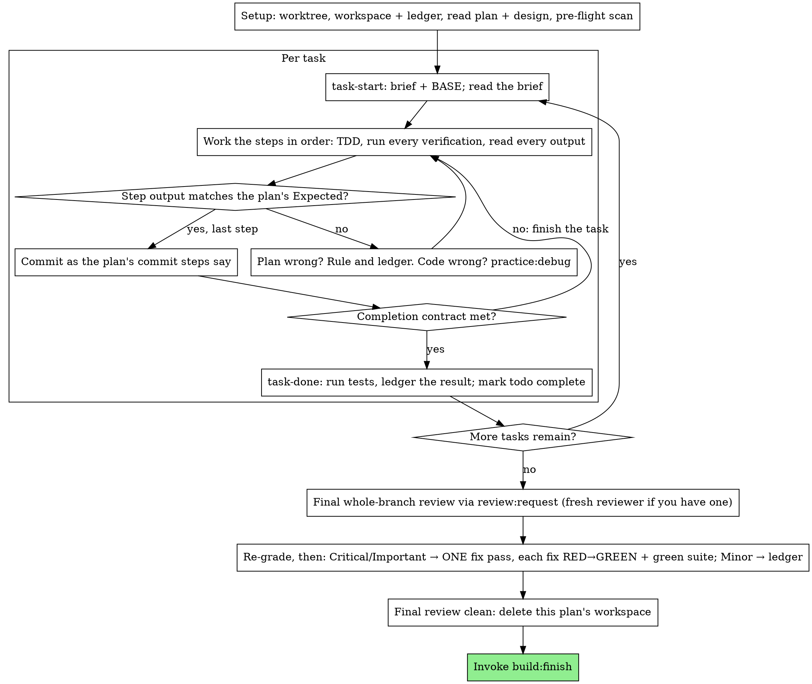

# Execute

Execute the plan yourself, task by task, in this session: no implementer subagent per task, no reviewer per task.
One fresh-context review of the whole branch at the end.

**Why inline.** `build:delegate` pays for a fresh implementer and a fresh reviewer on every task, each re-reading the codebase from zero.
Inline execution pays for one context (yours) plus one reviewer at the end.
What it gives up is a fresh context per task and a second pair of eyes per task.
This skill keeps what those two things bought, by other means: the brief is the spec, the ledger is your memory, TDD is the per-task gate, and the final reviewer is the second pair of eyes.

**Core principle.** The plan already did the thinking.
Execute it exactly, prove each step with a test you watched fail and then pass, and leave a record that survives your own forgetting.

**Narration.** Between tool calls, narrate at most one short line; the ledger and the tool results carry the record.

**Continuous execution.** Do not pause to check in with the user between tasks.
They review at two gates only: the plan before execution, and the finished branch afterwards.
They chose inline execution to spend less, not to answer "should I continue?" after every task.
Execute all tasks from the plan without stopping.

**Rulings, not stalls.** Conflicts, ambiguities, plan defects: decide them.
The spec is the binding authority, the plan is its argument, and your judgment settles what neither answers.
Record every decision in the ledger as `Ruling: <what you decided>; <why>; <what it costs if wrong>`, and keep going.
Deviating from the plan without a ledgered ruling is a decision made in secret.

**Five things stop you, and only these:** an irreversible or destructive operation; a security-sensitive action; a side effect outside this worktree that norms say you ask about first (a merge, a push to a shared branch, a publish); a plan so broken that every path forward is a guess; and a check or hook that you could only get past by disabling, skipping or weakening it.
For those, stop and ask.
Never disable, skip or weaken a check or hook to make something pass.

## When to use

- You have a plan from `build:plan` and the user chose inline execution at the handoff.
- Your harness has no subagent tool.
  Never fabricate a dispatch; run the plan here.
- Tasks are mostly independent, the same precondition as `build:delegate`.

A fully specified plan makes inline execution transcription plus testing: it runs well on a mid-tier session model, and the one place the most capable model earns its cost is the final review, which this skill dispatches separately.
Tell the user so when they choose inline.

Prefer `build:delegate` when the user wants a review gate on every task, or when the plan is long enough that its later tasks would run on a compacted context.
Inline execution over a long plan still works, the ledger is what makes it recoverable, but the last tasks get the least of you.

## The process



## Setup

### Isolated workspace

Ask the user once, at setup, whether to work in an isolated worktree, unless their instructions already say.
Prefer the harness's native worktree tool when one exists.
Otherwise fall back to git, with `.worktrees/` git-ignored:

```bash
git worktree add .worktrees/<branch> <branch>   # add -b <branch> when the branch does not exist yet
```

Never run a package install in the worktree: the environment is the repository's declared environment, and it follows the worktree.
Never start implementation on the main branch without the user's explicit consent.
`build:plan` committed the plan on the feature branch, so switch to that branch or create the worktree from it.

#### With devenv

Entering the worktree and running `devenv shell` gives the same environment as the main checkout; there is nothing to install.

### Workspace and ledger

Conversation memory does not survive compaction.
An inline executor that loses its place re-implements tasks whose commits already exist, the same failure as a controller re-dispatching them, paid for in your own context.
Track progress in a ledger file, not only in todos.
The harness's todo list is a live view; the ledger is the record.

The workspace and ledger are shared with `build:delegate`, same directory, same format, so a plan can change executors mid-flight and the new one resumes from the same ledger.

- Each plan owns a workspace: at skill start, run `../delegate/scripts/workspace PLAN_FILE` from this skill's directory (the script lives in `build:delegate`, which shares the workspace).
  It prints the plan's git-ignored directory, `<repo-root>/tmp/build/<plan-slug>/`, home to every artifact for this plan: ledger, briefs, review packages.
  Another plan's directory is never yours to read or write.
- Check for this plan's ledger at `<workspace>/progress.md`.
  If its first line names your plan file, tasks with a `Task <N>: complete` line are done: do not redo them; resume at the first task without one.
  Their commits exist in git even when your context no longer remembers making them: after compaction, trust the ledger and `git log` over your own recollection.
  A ledger whose first line names a different plan file is another plan's progress: leave it and start your own, fresh.
- Create the ledger with its identity as the first line: `# build ledger: plan <plan file path>`.
- `git clean -fdx` will destroy the workspace (it is git-ignored scratch), and `tmp/` may be emptied at any time; if that happens, recover from `git log`.

### Read the plan

Read the plan once, note its context and Global Constraints, and create a todo per task.
Read the spec it names too: normally the `## Design` section of the same file, otherwise the external spec the plan header points at.
The spec is the authority the plan argues from, and conflicts inside the plan resolve against it.
A plan with no reachable spec gets a ledger note saying so; rulings made without one are provisional.

**Required sub-skill:** call the Skill tool for `practice:tdd` now, before Task 1.
It governs every step of every task below; a plan whose steps already say "write the failing test first" does not exempt you from reading it.

Before Task 1, scan the plan for conflicts between tasks.
The plan's Interfaces blocks tell you where to look: for every task that consumes what an earlier task produces, one ledger row with the two tasks, what one produces against what the other consumes, and what you found.
Tasks that share nothing get no row; a plan whose tasks share nothing gets the single line `Pre-flight: no shared interfaces`.
Rule on each conflict a row surfaces with the spec as the binding authority, record the ruling beside its row, and start Task 1.
Each task's own text is checked when you read its brief, not here.

## The task loop

Everything you print, and every tool result, stays resident in your context for the rest of the session.
Redirect long test output to a file in the workspace and read its tail; read a brief, not the whole plan.

### 1. Take the task

- Run this skill's `scripts/task-start PLAN_FILE N`.
  It prints the brief path and BASE (the commit the task's range is cut from) in one call.
  Read the brief for every task, including ones you remember from setup: what you remember is a summary, the brief has the exact values, signatures and test cases.
- Mark the task's todo in progress.

Every tool call is a turn that re-reads your whole context.
Bookkeeping rides along with work: a ledger append in the same call as the commit, never in a call of its own.

### 2. Work the steps

The plan's steps are already in RED-GREEN order; follow them in that order under `practice:tdd`, loaded at setup.
A test step's code is written first and run first.
Watching it fail is a step, not a formality: a test that passes before the implementation exists is a finding about the test.

Every step that runs a command has an `Expected:` line.
Run the command, read its output, and compare.
Three outcomes:

- **Matches.** Next step.
- **The code is wrong.** Call the Skill tool for `practice:debug`.
  Find the cause; never patch the symptom to make the step's output match.
- **The plan is wrong.** A step contradicts the spec, an interface from an earlier task does not match what this task consumes, a command cannot work.
  Rule on the smallest change that satisfies the spec, ledger it as `Task <N>: Ruling: <finding>; <what you decided and why>`, and continue.
  The ruling is carried, not remembered: later tasks that touch the same interface read it from the ledger.

Commit as the plan's commit steps say: one commit per task on the feature branch, Conventional Commits, one concern per commit.
A task that spans several commits is fine when the plan says so; BASE is what the review range is cut from, never `HEAD~1`.
Never commit on main.

### 3. The completion contract

Before a task's ledger line, all of the following are true, with evidence in this session, not inferred from the diff looking right:

- Every test the brief names exists and ran in this task, and you read the output.
- The final test run for the task passed: `task-done` is that run, and it writes the command and result into the ledger line.
- Every `Expected:` line in the brief was compared against real output.
- Every deviation from the brief has a `Ruling:` line in the ledger.

**Required sub-skill:** `practice:verify` governs the claim.
If any item is missing, the task is not complete: finish it.

### 4. Complete the task

Run this skill's `scripts/task-done PLAN_FILE N BASE -- <test command>` with the repository's test command, scoped to the task as the brief says.
It runs the tests, keeps the full output in the workspace, prints the tail, and, only if they pass, appends the completion line to the ledger:

`Task <N>: complete (commits <base7>..<head7>, tests: <command> → <result>)`

A failing run records nothing; the task is not complete.
When it records, mark the todo complete and take the next task.

## Final review

Run `../delegate/scripts/review-package PLAN_FILE MERGE_BASE HEAD` from this skill's directory (MERGE_BASE is the commit the branch started from, for example `git merge-base main HEAD`) and review from the file it prints.

**With a subagent tool.** Call the Skill tool for `review:request`; it holds the reviewer template.
Dispatch the reviewer on the most capable available model, since the whole-branch review is a judgment task, and hand it: the review package path; the plan and its Design section (or the external spec); the plan's Review Focus section verbatim, if it has one (the input classes and failure modes the plan's tests do not exercise, which the reviewer checks deliberately); and the ledger's `Ruling:` lines, so it can weigh the calls you made.
Specify the model explicitly; an omitted model inherits the session's, which may not be the most capable.
This is the one fresh context the whole run buys.
Do not skip it, and do not replace it with your own read of the diff.

**Without a subagent tool.** Invoke `review:request` anyway and apply its reviewer brief yourself against the package, as a separate pass after the last task's ledger line.
Write `Final review: self-review (no subagent tool)` to the ledger, and say so in your final message: a self-review by the author is weaker than a fresh reviewer, and the user decides whether that is enough before merge.

Sort the findings before you act on any of them.
The reviewer's severity labels are advice; the gate is yours.
Its "Declined to judge" list is yours too: every line there is a ruling you make and ledger, exactly like a plan conflict, as `Final: Ruling: <behaviour the reviewer set aside>; <what a reasonable person using this software gets, and why that stands or why it is now a finding>; <cost if wrong>`.
Re-grade first, by effect: the spec is a vision document, and a finding's grade is what a reasonable person using this software gets if it ships, not whether the spec names the input that triggers it.
A reviewer who set a finding at Minor because the spec was silent has graded the spec, not the effect.
Then:

- **Critical and Important** enter the fix pass.
- **Minor** goes to the ledger as `Final: minor (deferred): <one-liner>` and to your final message under "Deferred minors".
  Minors never enter the fix pass, and never become rulings: a ruling is a decision about a conflict, not a note that you declined a polish suggestion.

Fix the Critical and Important findings yourself, you are the implementer here, in ONE pass.
Each fix is verified by TDD, not by a second reviewer: write the test that reproduces the finding, watch it fail, make it pass, then run the whole suite.
Record each in the ledger as `Final: fixed <finding>; <test name> RED→GREEN, suite <N>/<N>`.
A fix without a test that failed first is not verified; a suite that is not green after the pass means the pass is not over.
Do not dispatch a re-review: it would re-read a diff whose covering tests already answer "addressed" and whose suite run already answers "broke nothing".

A finding you decide not to fix is a ruling, `Final: Ruling: <finding>; <why the code stands>; <cost if wrong>`, and reaches the user in the rulings list.
There is no second fix pass.

## Finish

Before you delete anything, collect every ledger line containing `Ruling:` into your final message under "Rulings I made", in the order you made them, each with what it costs if wrong, and every `minor (deferred)` line under "Deferred minors".
Both lists are exhaustive.
Your final message is the only place the decisions you took on the user's behalf, and the findings you chose not to act on, reach them: the user reads the finished branch starting from these two lists.

When the final review is clean and its fixes are committed, delete this plan's workspace directory; the git history is the record now.
Sibling directories belong to other plans; leave them alone.

Call the Skill tool for `build:finish`.

## Common rationalizations

| Excuse | Reality |
| --- | --- |
| "I remember what Task N says" | You remember a summary. The brief has the exact values. Read it. |
| "The plan's code is right, skip watching the test fail" | A test you never saw fail proves nothing. It is one step. Run it. |
| "I'll run the full suite at the end instead of per step" | Per-step runs are how you learn which step broke it. The end-of-task run is the contract, not a substitute. |
| "The plan is wrong here, I'll just do the right thing" | Do the right thing and ledger the ruling. Unledgered deviation is a decision made in secret. |
| "I'll write the ledger lines after a few tasks" | Compaction does not wait for a convenient moment. One line per task, in the same message as the commit. |
| "Let me check in before the next task" | They chose inline to spend less. Progress prompts spend their time instead. Only the five stops stop you. |
| "The hook fails on something unrelated, I'll skip it for this commit" | A check you would have to skip is a stop condition, not an obstacle. Stop and ask. |
| "I read my own diff carefully; the final reviewer is redundant" | Same author, same blind spots. The reviewer is the only fresh context this run buys. |
| "Tests should pass, the change was trivial" | "Should" is not evidence. The contract requires the command and its output. |
| "Subagents are slow and expensive, I'll skip the final review too" | Inline already removed the per-task reviewers. One review of the whole branch is the floor, not the ceiling. |
| "The reviewer said Minor, so it's Minor" | The label graded the spec's silence. Grade what the person gets. Re-grade, then gate. |
| "The fix is obvious, no need for a failing test first" | The failing test is the only proof the finding was real and is now gone. Without it you have a diff and a hope. |
| "I'll fix the minors too while I'm in there" | Every minor you fix is a test, a fix, and a suite run the user did not ask for. Ledger them; the user decides. |

## Example workflow

The test command below is an example; the repository's own decides.

```text
[Setup: worktree confirmed with the user; on branch feature/recovery]
[Read plan once: docs/plans/2026-09-23-recovery.md; Design section read]
[Resolve workspace: ../delegate/scripts/workspace docs/plans/2026-09-23-recovery.md; no ledger inside, fresh start]
[Pre-flight scan: 2 shared-interface rows, clean; written to ledger]
[Create todos for all tasks]

Task 1: Hook installation script

[task-start plan 1 → brief read; BASE a1b2c3d]
[Step 1: write failing test]
[Step 2: run it → FAIL: install_hook not defined. Matches Expected.]
[Step 3: implement]
[Step 4: run it → PASS 1/1. Matches Expected.]
[Step 5: commit → d4e5f6a]
[Contract: tests ran, output read, no deviations]
[task-done plan 1 a1b2c3d -- npm test -- hooks → ledger: Task 1: complete (commits a1b2c3d..d4e5f6a, tests: npm test -- hooks → 1/1 pass)]

Task 2: Recovery modes

[task-start plan 2 → brief read; BASE d4e5f6a]
[Step 2: run failing test → FAIL, but on an import error: Task 1 exported installHook, the brief consumes install_hook]
[Ruling: the brief's consumer name misspells Task 1's Produces block; use installHook]
[Ledger: Task 2: Ruling: install_hook → installHook; matches Task 1 Produces; cost if wrong: one rename]
[Steps 2 to 5 as planned; commit b7c8d9e]
[task-done plan 2 d4e5f6a -- npm test -- recovery → ledger: Task 2: complete (commits d4e5f6a..b7c8d9e, tests: npm test -- recovery → 8/8 pass)]

...

[After all tasks: review-package plan MERGE_BASE HEAD; review:request on the most capable model]
Reviewer: one Important finding, progress reporting interval hardcoded. Two Minor.
[Re-grade: Important stands; minors → ledger as deferred]
[Fix pass: test_progress_interval_configurable RED → extract PROGRESS_INTERVAL → GREEN; suite 12/12; commit]
[Ledger: Final: fixed hardcoded interval; test_progress_interval_configurable RED→GREEN, suite 12/12]

Rulings I made:
- Task 2: install_hook → installHook (brief misspelling; cost if wrong: one rename)

Deferred minors:
- README lacks a usage example
- recovery.js could split verify/repair into two files

[Delete this plan's workspace; the record now lives in git]

Invoking build:finish.
```
