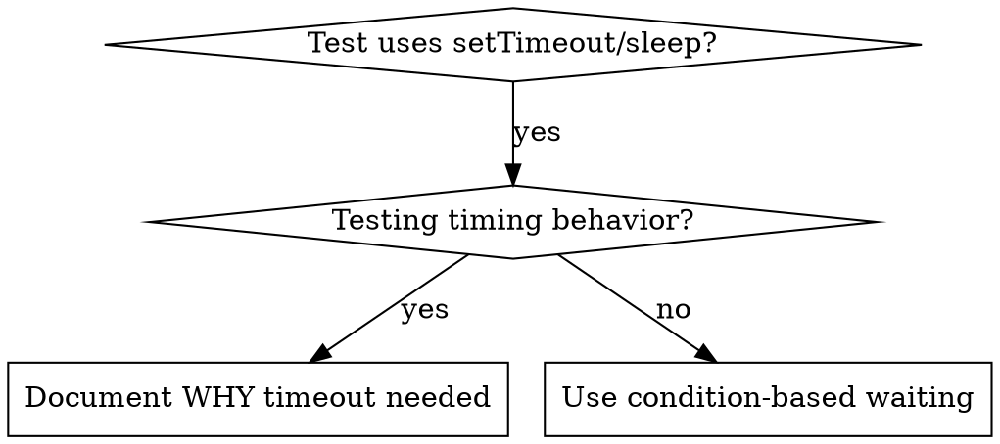

# Condition-based waiting

## Overview

Flaky tests often guess at timing with arbitrary delays.
This creates race conditions where tests pass on fast machines but fail under load or in CI.

**Core principle:** wait for the actual condition you care about, not a guess about how long it takes.

## When to use



**Use when:**

- Tests have arbitrary delays (`setTimeout`, `sleep`, `time.sleep()`)
- Tests are flaky (pass sometimes, fail under load)
- Tests time out when run in parallel
- Waiting for async operations to complete

**Do not use when:**

- Testing actual timing behaviour (debounce, throttle intervals)
- Always document WHY when using an arbitrary timeout

## Core pattern

```typescript
// ❌ BEFORE: guessing at timing
await new Promise(r => setTimeout(r, 50));
const result = getResult();
expect(result).toBeDefined();

// ✅ AFTER: waiting for the condition
await waitFor(() => getResult() !== undefined);
const result = getResult();
expect(result).toBeDefined();
```

## Quick patterns

| Scenario | Pattern |
| --- | --- |
| Wait for event | `waitFor(() => events.find(e => e.type === 'DONE'))` |
| Wait for state | `waitFor(() => machine.state === 'ready')` |
| Wait for count | `waitFor(() => items.length >= 5)` |
| Wait for file | `waitFor(() => fs.existsSync(path))` |
| Complex condition | `waitFor(() => obj.ready && obj.value > 10)` |

## Implementation

A generic polling function:

```typescript
async function waitFor<T>(
  condition: () => T | undefined | null | false,
  description: string,
  timeoutMs = 5000
): Promise<T> {
  const startTime = Date.now();

  while (true) {
    const result = condition();
    if (result) return result;

    if (Date.now() - startTime > timeoutMs) {
      throw new Error(`Timeout waiting for ${description} after ${timeoutMs}ms`);
    }

    await new Promise(r => setTimeout(r, 10)); // Poll every 10ms
  }
}
```

See [condition-based-waiting-example.ts](condition-based-waiting-example.ts) next to this file for a complete implementation with domain-specific helpers (`waitForEvent`, `waitForEventCount`, `waitForEventMatch`).
It is an example to adapt, not code that anything runs.

## Common mistakes

- **Polling too fast:** `setTimeout(check, 1)` wastes CPU.
  Poll every 10ms.
- **No timeout:** the loop runs forever if the condition is never met.
  Always include a timeout with a clear error.
- **Stale data:** caching the state before the loop.
  Call the getter inside the loop for fresh data.

## When an arbitrary timeout is correct

```typescript
// The tool ticks every 100ms; two ticks are needed to verify partial output
await waitForEvent(manager, 'TOOL_STARTED'); // First: wait for the condition
await new Promise(r => setTimeout(r, 200));   // Then: wait for the timed behaviour
// 200ms = 2 ticks at 100ms intervals, documented and justified
```

**Requirements:**

1. First wait for the triggering condition
2. Base the delay on known timing, not a guess
3. Comment explaining WHY
