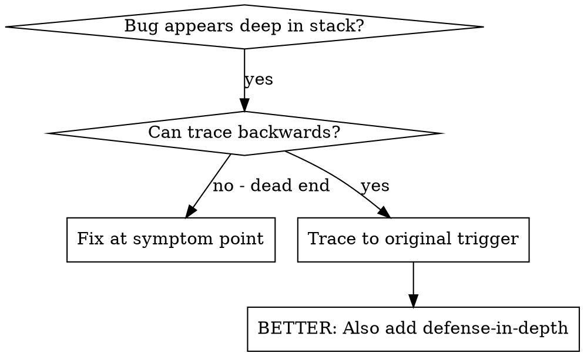
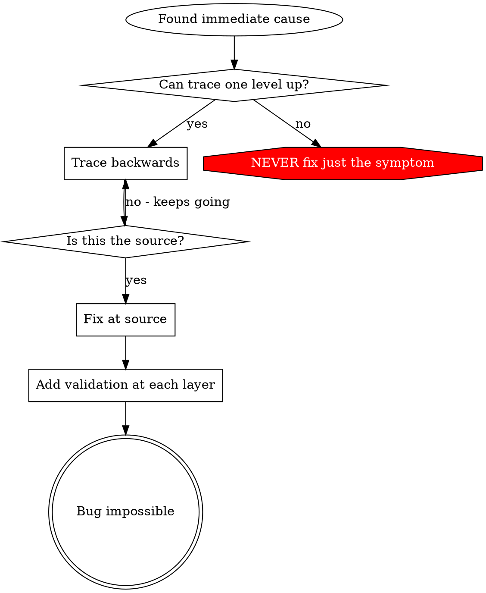

# Root cause tracing

## Overview

Bugs often show up deep in the call stack (git init in the wrong directory, a file created in the wrong location, a database opened with the wrong path).
Your instinct is to fix where the error appears, but that is treating a symptom.

**Core principle:** trace backward through the call chain until you find the original trigger, then fix at the source.

## When to use



**Use when:**

- The error happens deep in execution (not at the entry point)
- The stack trace shows a long call chain
- It is unclear where the invalid data originated
- You need to find which test or code triggers the problem

## The tracing process

### 1. Observe the symptom

```text
Error: git init failed in ~/project/packages/core
```

### 2. Find the immediate cause

What code directly causes this?

```typescript
await execFileAsync('git', ['init'], { cwd: projectDir });
```

### 3. Ask: what called this?

```typescript
WorktreeManager.createSessionWorktree(projectDir, sessionId)
  -> called by Session.initializeWorkspace()
  -> called by Session.create()
  -> called by test at Project.create()
```

### 4. Keep tracing up

What value was passed?

- `projectDir = ''` (an empty string)
- An empty string as `cwd` resolves to `process.cwd()`
- That is the source code directory

### 5. Find the original trigger

Where did the empty string come from?

```typescript
const context = setupCoreTest(); // Returns { tempDir: '' }
Project.create('name', context.tempDir); // Accessed before beforeEach!
```

## Adding stack traces

When you cannot trace manually, add instrumentation:

```typescript
// Before the problematic operation
async function gitInit(directory: string) {
  const stack = new Error().stack;
  console.error('DEBUG git init:', {
    directory,
    cwd: process.cwd(),
    nodeEnv: process.env.NODE_ENV,
    stack,
  });

  await execFileAsync('git', ['init'], { cwd: directory });
}
```

**Critical:** in tests, use `console.error()`, not the logger, which may be suppressed.

Run and capture, with the repository's test command (here `npm test`):

```bash
npm test 2>&1 | grep 'DEBUG git init'
```

Analyze the stack traces:

- Look for test file names
- Find the line number triggering the call
- Identify the pattern (same test? same parameter?)

## Finding which test causes pollution

If something appears during the tests but you do not know which test creates it, use the bisection script `scripts/find-polluter.sh` in this skill's directory.
It takes the path to watch, a glob for the test files, and the repository's command that runs one test file:

```bash
bash scripts/find-polluter.sh '.git' 'src/**/*.test.ts' 'npm test'
```

It runs the test files one by one and stops at the first one that creates the path.
See the script for the usage text.

## Example: empty projectDir

**Symptom:** `.git` created in `packages/core/` (source code).

**Trace chain:**

1. `git init` runs in `process.cwd()` because the `cwd` parameter is empty
2. WorktreeManager is called with an empty projectDir
3. Session.create() passed the empty string
4. The test accessed `context.tempDir` before beforeEach
5. setupCoreTest() returns `{ tempDir: '' }` initially

**Root cause:** top-level variable initialization accessing an empty value.

**Fix:** made tempDir a getter that throws if accessed before beforeEach.

**Also added defense in depth:**

- Layer 1: Project.create() validates the directory
- Layer 2: WorkspaceManager validates not empty
- Layer 3: a NODE_ENV guard refuses git init outside the temp directory
- Layer 4: stack trace logging before git init

## Key principle



**Never fix just where the error appears.**
Trace back to find the original trigger.

## Stack trace tips

- **In tests:** use `console.error()`, not the logger, which may be suppressed
- **Before the operation:** log before the dangerous operation, not after it fails
- **Include context:** directory, cwd, environment variables, timestamps
- **Capture the stack:** `new Error().stack` shows the complete call chain
