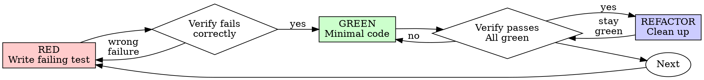

# Test-driven development

## Overview

Write the test first.
Watch it fail.
Write the minimal code to pass.

**Core principle:** if you did not watch the test fail, you do not know whether it tests the right thing.

**Violating the letter of the rules is violating the spirit of the rules.**

## When to use

**Always:**

- New features
- Bug fixes
- Refactoring (the tests exist before you start and stay green throughout)
- Behaviour changes

**Exceptions (ask the user):**

- Throwaway prototypes
- Generated code
- Configuration files

A mechanical rename with no behaviour change needs no new test; the existing tests prove it changed nothing.

Thinking "skip TDD just this once"?
Stop.
That is a rationalization.

## The iron law

```text
NO PRODUCTION CODE WITHOUT A FAILING TEST FIRST
```

Wrote code before the test?
Delete it.
Start over.

**No exceptions:**

- Do not keep it as "reference"
- Do not "adapt" it while writing tests
- Do not look at it
- Delete means delete

Implement fresh from the tests.

## Red, green, refactor



### RED: write a failing test

Write one minimal test showing what should happen.

**Good:** clear name, tests real behaviour, one thing.

```typescript
test('retries failed operations 3 times', async () => {
  let attempts = 0;
  const operation = () => {
    attempts++;
    if (attempts < 3) throw new Error('fail');
    return 'success';
  };

  const result = await retryOperation(operation);

  expect(result).toBe('success');
  expect(attempts).toBe(3);
});
```

**Bad:** vague name, tests the mock instead of the code.

```typescript
test('retry works', async () => {
  const mock = jest.fn()
    .mockRejectedValueOnce(new Error())
    .mockRejectedValueOnce(new Error())
    .mockResolvedValueOnce('success');
  await retryOperation(mock);
  expect(mock).toHaveBeenCalledTimes(3);
});
```

**Requirements:**

- One behaviour
- Clear name
- Real code (no mocks unless unavoidable)

### Verify RED: watch it fail

**Mandatory. Never skip.**

Run the repository's test command for that file, for example:

```bash
npm test path/to/test.test.ts
```

Confirm:

- The test fails (it does not error)
- The failure message is the expected one
- It fails because the feature is missing, not because of a spelling mistake

**Test passes?**
You are testing existing behaviour.
Fix the test.

**Test errors?**
Fix the error and re-run until it fails correctly.

### GREEN: minimal code

Write the simplest code that passes the test.

**Good:** just enough to pass.

```typescript
async function retryOperation<T>(fn: () => Promise<T>): Promise<T> {
  for (let i = 0; i < 3; i++) {
    try {
      return await fn();
    } catch (e) {
      if (i === 2) throw e;
    }
  }
  throw new Error('unreachable');
}
```

**Bad:** over-engineered.

```typescript
async function retryOperation<T>(
  fn: () => Promise<T>,
  options?: {
    maxRetries?: number;
    backoff?: 'linear' | 'exponential';
    onRetry?: (attempt: number) => void;
  }
): Promise<T> {
  // YAGNI
}
```

Do not add features, refactor other code, or "improve" beyond the test.

### Verify GREEN: watch it pass

**Mandatory.**

Run the repository's test command for that file again, for example:

```bash
npm test path/to/test.test.ts
```

Confirm:

- The test passes
- The other tests still pass
- The output is pristine (no errors, no warnings)

**Test fails?**
Fix the code, not the test.

**Other tests fail?**
Fix them now.

**"Other tests" means the repository's whole suite, not just your file.**
A green run of the test you wrote is not a green suite.
Before you call the change done, run the repository's test command (bare `pytest`, `npm test`, `cargo test`, whatever the repository uses) even when your task named only one test file.
A scope statement in your task bounds the deliverable, not your verification.
Any failure that run shows, including one you did not cause, goes in your report by name.
A red test you watched scroll past and did not mention is a report falsified by omission.

### REFACTOR: clean up

After green only:

- Remove duplication
- Improve names
- Extract helpers

Keep the tests green.
Do not add behaviour.

### Repeat

Next failing test for the next behaviour.

## Good tests

| Quality | Good | Bad |
| --- | --- | --- |
| **Minimal** | One thing. "and" in the name? Split it. | `test('validates email and domain and whitespace')` |
| **Clear** | The name describes the behaviour | `test('test1')` |
| **Shows intent** | Demonstrates the desired API | Obscures what the code should do |

When writing or changing any test, read [writing-good-tests.md](references/writing-good-tests.md) for the rules that keep tests honest:

- Name the production change that would make the test fail, before writing it
- Assert on real behaviour, never on mock behaviour
- Keep test-only code in test utilities, out of production classes
- Understand a dependency's side effects before mocking it

## Common rationalizations

| Excuse | Reality |
| --- | --- |
| "Too simple to test" | Simple code breaks. The test takes 30 seconds. |
| "I'll test after" | Tests written after pass immediately, which proves nothing. They may test the wrong thing, test the implementation instead of the behaviour, or miss the edge case you forgot. You never watched it fail, so you never proved it can catch the bug. Test-first forces that failure. |
| "Tests after achieve the same goals (spirit, not ritual)" | Tests-after answer "what does this do?"; tests-first answer "what should this do?" Tests written after are biased by the code you already wrote: you verify the cases you remembered, not the ones you would have discovered. Coverage without proof that the tests work. |
| "Already manually tested" | Manual testing is ad hoc: no record of what you covered, no way to re-run it when the code changes, easy to forget cases under pressure. "Worked when I tried it" is not comprehensive. Automated tests run the same way every time. |
| "Deleting X hours of work is wasteful" | Sunk cost: that time is spent either way. The real choice is rewriting with TDD (high confidence) against keeping it and bolting tests on after (low confidence, likely bugs). Keeping code you cannot trust is the waste. |
| "Keep it as reference, write tests first" | You will adapt it. That is testing after. Delete means delete. |
| "Need to explore first" | Fine. Throw the exploration away, then start with TDD. |
| "The test is hard, so the design is unclear" | Listen to the test. Hard to test means hard to use. |
| "TDD will slow me down" | TDD is the pragmatic path: it catches bugs before the commit, prevents regressions, and lets you refactor without fear. "Pragmatic" shortcuts mean debugging in production, which is slower, not faster. |
| "A manual test is faster" | Manual testing does not prove edge cases. You will re-test on every change. |
| "The existing code has no tests" | You are improving it. Add tests for the existing code. |

## Red flags: stop and start over

- Code before test
- Test after implementation
- Test passes immediately
- Cannot explain why the test failed
- Tests added "later"
- Rationalizing "just this once"
- "I already manually tested it"
- "Tests after achieve the same purpose"
- "It's about spirit, not ritual"
- "Keep it as reference" or "adapt the existing code"
- "Already spent X hours, deleting is wasteful"
- "TDD is dogmatic, I'm being pragmatic"
- "This is different because..."

**All of these mean: delete the code. Start over with TDD.**

## Example: bug fix

**Bug:** an empty email is accepted.

### RED

```typescript
test('rejects empty email', async () => {
  const result = await submitForm({ email: '' });
  expect(result.error).toBe('Email required');
});
```

### Verify RED

With the repository's test command, here `npm test`:

```bash
$ npm test
FAIL: expected 'Email required', got undefined
```

### GREEN

```typescript
function submitForm(data: FormData) {
  if (!data.email?.trim()) {
    return { error: 'Email required' };
  }
  // ...
}
```

### Verify GREEN

```bash
$ npm test
PASS
```

### REFACTOR

Extract the validation for multiple fields if needed.

## Verification checklist

Before marking the work complete:

- [ ] Every new function or method has a test
- [ ] Watched each test fail before implementing
- [ ] Each test failed for the expected reason (feature missing, not a spelling mistake)
- [ ] Wrote minimal code to pass each test
- [ ] All tests pass
- [ ] Output pristine (no errors, no warnings)
- [ ] Tests use real code (mocks only if unavoidable)
- [ ] Edge cases and errors covered

Cannot check every box?
You skipped TDD.
Start over.

## When stuck

| Problem | Solution |
| --- | --- |
| Do not know how to test | Write the wished-for API. Write the assertion first. Ask the user. |
| Test too complicated | Design too complicated. Simplify the interface. |
| Must mock everything | Code too coupled. Use dependency injection. |
| Test setup huge | Extract helpers. Still complex? Simplify the design. |

## Debugging integration

Bug found?
Invoke `practice:debug` to find the root cause first.
Then write the failing test that reproduces it and follow the cycle above.
The test proves the fix and prevents the regression.

Never fix a bug without a test.

## Verification

Before claiming the work is done, invoke `practice:verify`: a claim needs the command and its output in the same message.

## Final rule

```text
Production code -> a test exists and failed first
Otherwise       -> not TDD
```

No exceptions without the user's permission.
